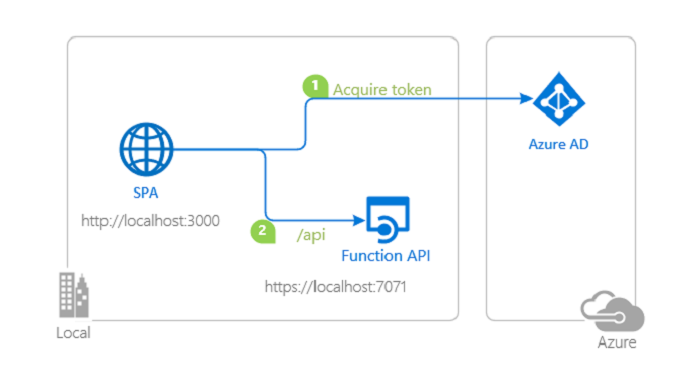

# A Node.js Azure Function Web API secured by Azure AD

 1. [Overview](#overview)
 1. [Scenario](#scenario)
 1. [Contents](#contents)
 1. [Prerequisites](#prerequisites)
 1. [Setup](#setup)
 1. [Registration](#registration)
 1. [Running the sample](#running-the-sample)
 1. [Explore the sample](#explore-the-sample)
 1. [About the code](#about-the-code)
 1. [Deployment](#deployment)
 1. [More information](#more-information)
 1. [Community Help and Support](#community-help-and-support)
 1. [Contributing](#contributing)
 1. [Code of Conduct](#code-of-conduct)

## Overview

This sample demonstrates how to secure an [Azure Function](https://docs.microsoft.com/azure/azure-functions/functions-overview) with [Azure Active Directory (Azure AD)](https://docs.microsoft.com/azure/active-directory/fundamentals/active-directory-whatis) where the function uses an [HTTPTrigger](https://docs.microsoft.com/azure/azure-functions/functions-bindings-http-webhook-trigger) and exposes a Web API. The Web API is written in [Node.js](https://nodejs.org) using the [Express](https://expressjs.com/) framework, and the authentication is provided by [passport-azure-ad](https://github.com/AzureAD/passport-azure-ad) library.

The sample further utilizes the [azure-function-express] library, which connects your **Express** application to an [Azure Function handler](https://docs.microsoft.com/azure/azure-functions/functions-reference-node), allowing you to write **Azure Function** applications using the middlewares that you are **already familiar with**.

## Scenario

1. The client JavaScript SPA application uses the [Microsoft Authentication Library for JavaScript (MSAL.js)](https://github.com/AzureAD/microsoft-authentication-library-for-js) to obtain a JWT [Access Token](https://docs.microsoft.com/azure/active-directory/develop/access-tokens) from **Azure AD**.
2. The **Access Token** is used as a *bearer* token to authenticate the user when calling the **Azure Function** app.



## Contents

| File/folder       | Description                                |
|-------------------|--------------------------------------------|
| `Function`        | The Azure function source code.            |
| `AppCreationScripts`| The Azure function source code.          |
| `ReadmeFiles`     | Images used in readme.md.                  |
| `CHANGELOG.md`    | List of changes to the sample.             |
| `CONTRIBUTING.md` | Guidelines for contributing to the sample. |
| `SECURITY.md`     | Security disclosures for the sample.       |
| `LICENSE`         | The license for the sample.                |

## Prerequisites

- [Node.js](https://nodejs.org/en/download/) must be installed to run this sample.
- A modern web browser. This sample uses **ES6** conventions and will not run on **Internet Explorer**.
- [Visual Studio Code](https://code.visualstudio.com/download) is recommended for running and editing this sample.
- [VS Code Azure Tools](https://marketplace.visualstudio.com/items?itemName=ms-vscode.vscode-node-azure-pack) extension is recommended for interacting with **Azure** through **VS Code** interface.
- An **Azure AD** tenant. For more information see: [How to get an Azure AD tenant](https://azure.microsoft.com/documentation/articles/active-directory-howto-tenant/)
- A user account in your **Azure AD**. This sample will not work with a **personal Microsoft account**. Therefore, if you signed in to the [Azure portal](https://portal.azure.com) with a personal account and have never created a user account in your directory before, you need to do that now.
- [Azure Functions Core Tools](https://www.npmjs.com/package/azure-functions-core-tools) **NPM** package must be installed *globally* to run this sample (`npm install -g Azure-functions-core-tools`).

## Setup

### Step 1: Clone or download this repository

From your shell or command line:

```console
    git clone https://github.com/Azure-Samples/ms-identity-nodejs-webapi-azurefunctions.git
```

or download and extract the repository .zip file.

> :warning: Given that the name of the sample is quite long, and so are the names of the referenced packages, you might want to clone it in a folder close to the root of your hard drive, to avoid maximum file path length limitations on Windows.

### Step 2: Install project dependencies

```console
    cd ms-identity-nodejs-webapi-azurefunctions
    cd Function
    npm install
```

### Register the sample application(s) with your Azure Active Directory tenant

There is one project in this sample. To register it, you can:

- follow the steps below for manually register your apps
- or use PowerShell scripts that:
  - **automatically** creates the Azure AD applications and related objects (passwords, permissions, dependencies) for you.
  - modify the projects' configuration files.

<details>
  <summary>Expand this section if you want to use this automation:</summary>

> :warning: If you have never used **Azure AD Powershell** before, we recommend you go through the [App Creation Scripts](./AppCreationScripts/AppCreationScripts.md) once to ensure that your environment is prepared correctly for this step.

1. On Windows, run PowerShell as **Administrator** and navigate to the root of the cloned directory
1. In PowerShell run:

   ```PowerShell
   Set-ExecutionPolicy -ExecutionPolicy RemoteSigned -Scope Process -Force
   ```

1. Run the script to create your Azure AD application and configure the code of the sample application accordingly.
1. In PowerShell run:

   ```PowerShell
   cd .\AppCreationScripts\
   .\Configure.ps1
   ```

   > Other ways of running the scripts are described in [App Creation Scripts](./AppCreationScripts/AppCreationScripts.md)
   > The scripts also provide a guide to automated application registration, configuration and removal which can help in your CI/CD scenarios.

</details>

### Choose the Azure AD tenant where you want to create your applications

As a first step you'll need to:

1. Sign in to the [Azure portal](https://portal.azure.com).
1. If your account is present in more than one Azure AD tenant, select your profile at the top right corner in the menu on top of the page, and then **switch directory** to change your portal session to the desired Azure AD tenant.

### Register the service app (ms-identity-nodejs-webapi-azurefunctions)

1. Navigate to the [Azure portal](https://portal.azure.com) and select the **Azure AD** service.
1. Select the **App Registrations** blade on the left, then select **New registration**.
1. In the **Register an application page** that appears, enter your application's registration information:
   - In the **Name** section, enter a meaningful application name that will be displayed to users of the app, for example `ms-identity-nodejs-webapi-azurefunctions`.
   - Under **Supported account types**, select **Accounts in this organizational directory only**.
1. Select **Register** to create the application.
1. In the app's registration screen, find and note the **Application (client) ID**. You use this value in your app's configuration file(s) later in your code.
1. Select **Save** to save your changes.
1. In the app's registration screen, select the **Expose an API** blade to the left to open the page where you can declare the parameters to expose this app as an Api for which client applications can obtain [access tokens](https://docs.microsoft.com/azure/active-directory/develop/access-tokens) for.
The first thing that we need to do is to declare the unique [resource](https://docs.microsoft.com/azure/active-directory/develop/v2-oauth2-auth-code-flow) URI that the clients will be using to obtain access tokens for this APIs. To declare a **resource URI**, follow the following steps:
   - Click `Set` next to the **Application ID URI** to generate a URI that is unique for this app.
   - For this sample, accept the proposed Application ID URI (api://{clientId}) by selecting **Save**.
1. All APIs have to publish a minimum of one [scope](https://docs.microsoft.com/azure/active-directory/develop/v2-oauth2-auth-code-flow#request-an-authorization-code) for the client's to obtain an access token successfully. To publish a scope, follow the following steps:
   - Select **Add a scope** button open the **Add a scope** screen and Enter the values as indicated below:
        - For **Scope name**, use `access_as_user`.
        - Select **Admins and users** options for **Who can consent?**
        - For **Admin consent display name** type `Access ms-identity-nodejs-webapi-azurefunctions`
        - For **Admin consent description** type `Allows the app to access ms-identity-nodejs-webapi-azurefunctions as the signed-in user.`
        - For **User consent display name** type `Access ms-identity-nodejs-webapi-azurefunctions`
        - For **User consent description** type `Allow the application to access ms-identity-nodejs-webapi-azurefunctions on your behalf.`
        - Keep **State** as **Enabled**
        - Click on the **Add scope** button on the bottom to save this scope.
1. In the app's registration screen, select the **Manifest** blade. Then:
   - Find the key `"accessTokenAcceptedVersion"` and replace the existing value with **2** i.e. `"accessTokenAcceptedVersion": 2`.

#### Configure the service app (ms-identity-nodejs-webapi-azurefunctions) to use your app registration

Open the project in your IDE (like Visual Studio or Visual Studio Code) to configure the code.

> In the steps below, "ClientID" is the same as "Application ID" or "AppId".

1. Open the `Function\auth.json` file.
1. Find the key `clientID` and replace the existing value with the **application ID** (clientId) of the `ms-identity-nodejs-webapi-azurefunctions` application copied from the Azure portal.
1. Find the key `tenantID` and replace the existing value with your Azure AD **tenant ID**.
1. Find the key `audience` and replace the existing value with the **application ID** (clientId) of the `ms-identity-nodejs-webapi-azurefunctions` application copied from the Azure portal.
1. Find the key `scope` and replace the existing value with the scope `access_as_user`.

## Running the sample

```console
    cd ms-identity-nodejs-webapi-azurefunctions
    cd Function
    func start
```

1. The function app will run on `http://localhost:7071/api` when you test it locally.
1. The function app will run on `https://<yournodejsfunction>.azurewebsites.net` when you run it deployed to Azure.

## Explore the sample

You will need a **client** for calling the Web API. Refer to the sample: [JavaScript single-page application calling a custom Web API with MSAL.js 2.x using the auth code flow with PKCE](https://github.com/Azure-Samples/ms-identity-javascript-callapi).

You will need a **client** for calling the web API. Refer to the sample: [Vanilla JavaScript Single-page Application secured with MSAL.js 2.x and calling a Web API secured with the Microsoft Identity Platform](https://github.com/Azure-Samples/ms-identity-javascript-callapi).

1. Open the `App\apiConfig.js` file.
1. Find the key `Enter_the_Web_Api_Uri_Here` and replace the existing value with the coordinates of your Web API (e.g. `http://localhost:7071/api`).
1. Find the key `Enter_the_Web_Api_Scope_Here` and replace the existing value with the scopes for your Web API (e.g. `api://e767d418-b80b-4568-9754-557f40697fc5/access_as_user`).

> :information_source: Did the sample not work for you as expected? Then please reach out to us using the [GitHub Issues](../../../../issues) page.

## About the code

### Function configuration

There are 3 files in the sample that are used to configure the function app:

- `Function/auth.json`
This file contains the configuration parameters that are used for authentication and token acquisition.

- `Function/host.json`
This file contains the configuration parameters that are used by the **Azure Functions Core Tools** package in local environment. When deployed, this file will overwritten by **Azure App Services**.

- `Function/MyHttpTrigger/function.json`
This file contains the configuration parameters for the behavior of the function web api. In particular, it defines the accepted http verbs and the exposed API endpoint.

> :information_source: `{*segments}` parameter is not used and could be anything. For more information, [see](https://github.com/Azure/azure-functions-host/wiki/Http-Functions).

### Token validation

[passport-azure-ad](https://github.com/AzureAD/passport-azure-ad) validates the token against the `issuer`, `scope` and `audience` claims (defined in `BearerStrategy` constructor) using the `passport.authenticate()` API:

```javascript
    app.get('/api', passport.authenticate('oauth-bearer', { session: false }),
        (req, res) => {
            console.log('Validated claims: ', req.authInfo);
    );
```

## Deployment

### Deployment to Azure Functions

There is one web project in this sample. To deploy it to **Function Apps**, you'll need to:

- create an **Function App**
- publish the projects to the **Function Apps**, and
- update its client(s) to call the deployed function instead of the local environment.

Follow the instructions here to deploy your **Azure Function** app via **VS Code Azure Tools Extension**: [Tutorial: Deploy a Functions app](https://docs.microsoft.com/azure/developer/javascript/tutorial-vscode-serverless-node-04).

> :warning: After deployment, make sure that the [App Service Authentication](https://docs.microsoft.com/azure/app-service/configure-authentication-provider-aad) is turned **off**, as we have manually configured our authentication solution in this sample.

Once you are done, you'll need to update the **client** app to be able to call the deployed **Azure Function**. To do so, follow the steps below:

1. Open the `App\apiConfig.js` file.
1. Find the key `Enter_the_Web_Api_Uri_Here` and replace the existing value with the coordinates of your Web API (e.g. `https://<yournodejsfunction>.azurewebsites.net/api`).

## More information

- [Microsoft identity platform (Azure Active Directory for developers)](https://docs.microsoft.com/azure/active-directory/develop/)
- [Overview of Microsoft Authentication Library (MSAL)](https://docs.microsoft.com/azure/active-directory/develop/msal-overview)
- [Quickstart: Register an application with the Microsoft identity platform (Preview)](https://docs.microsoft.com/azure/active-directory/develop/quickstart-register-app)
- [Quickstart: Configure a client application to access web APIs (Preview)](https://docs.microsoft.com/azure/active-directory/develop/quickstart-configure-app-access-web-apis)
- [Understanding Azure AD application consent experiences](https://docs.microsoft.com/azure/active-directory/develop/application-consent-experience)
- [Understand user and admin consent](https://docs.microsoft.com/azure/active-directory/develop/howto-convert-app-to-be-multi-tenant#understand-user-and-admin-consent)
- [Application and service principal objects in Azure Active Directory](https://docs.microsoft.com/azure/active-directory/develop/app-objects-and-service-principals)
- [National Clouds](https://docs.microsoft.com/azure/active-directory/develop/authentication-national-cloud#app-registration-endpoints)

- [Initialize client applications using MSAL.js](https://docs.microsoft.com/azure/active-directory/develop/msal-js-initializing-client-applications)
- [Single sign-on with MSAL.js](https://docs.microsoft.com/azure/active-directory/develop/msal-js-sso)
- [Handle MSAL.js exceptions and errors](https://docs.microsoft.com/azure/active-directory/develop/msal-handling-exceptions?tabs=javascript)
- [Logging in MSAL.js applications](https://docs.microsoft.com/azure/active-directory/develop/msal-logging?tabs=javascript)
- [Pass custom state in authentication requests using MSAL.js](https://docs.microsoft.com/azure/active-directory/develop/msal-js-pass-custom-state-authentication-request)
- [Prompt behavior in MSAL.js interactive requests](https://docs.microsoft.com/azure/active-directory/develop/msal-js-prompt-behavior)
- [Use MSAL.js to work with Azure AD B2C](https://docs.microsoft.com/azure/active-directory/develop/msal-b2c-overview)

- [MSAL code samples](https://docs.microsoft.com/azure/active-directory/develop/sample-v2-code)

For more information about how OAuth 2.0 protocols work in this scenario and other scenarios, see [Authentication Scenarios for Azure AD](https://docs.microsoft.com/azure/active-directory/develop/authentication-flows-app-scenarios).

## Community Help and Support

Use [Stack Overflow](http://stackoverflow.com/questions/tagged/msal) to get support from the community.
Ask your questions on Stack Overflow first and browse existing issues to see if someone has asked your question before.
Make sure that your questions or comments are tagged with [`azure-active-directory` `azure-ad-b2c` `ms-identity` `adal` `msal`].

If you find a bug in the sample, please raise the issue on [GitHub Issues](../../issues).

To provide a recommendation, visit the following [User Voice page](https://feedback.azure.com/forums/169401-azure-active-directory).

## Contributing

If you'd like to contribute to this sample, see [CONTRIBUTING.MD](/CONTRIBUTING.md).

This project has adopted the [Microsoft Open Source Code of Conduct](https://opensource.microsoft.com/codeofconduct/). For more information, see the [Code of Conduct FAQ](https://opensource.microsoft.com/codeofconduct/faq/) or contact [opencode@microsoft.com](mailto:opencode@microsoft.com) with any additional questions or comments.
